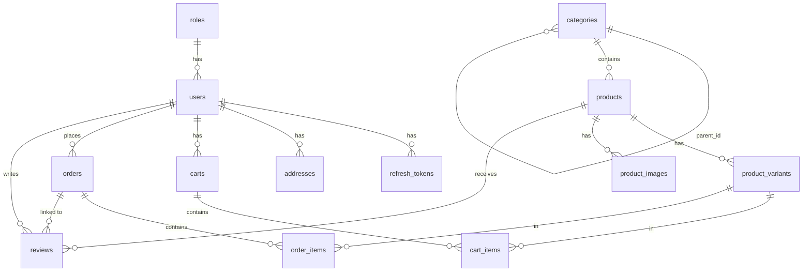

# DATABASE.md — ecommerce

## 1. Overview

- **Database:** MySQL 8.x
- **ORM:** TypeORM (NestJS integration)
- **Naming conventions:**
  - Tables: `snake_case`, plural → `users`, `products`, `orders`
  - Columns: `snake_case` → `created_at`, `user_id`
  - Foreign keys: `[singular_table]_id` → `user_id`, `product_id`
  - Indexes: `idx_[table]_[column]` → `idx_refresh_tokens_token_hash`

---

## 2. Entities by Feature

### Auth Feature

**Table: `roles`**
| Column | Type | Constraints |
|--------|------|-------------|
| id | BIGINT | PK, AUTO_INCREMENT |
| name | VARCHAR(50) | NOT NULL, UNIQUE |

**Table: `users`**
| Column | Type | Constraints |
|--------|------|-------------|
| id | BIGINT | PK, AUTO_INCREMENT |
| role_id | BIGINT | FK → roles |
| email | VARCHAR(255) | NOT NULL, UNIQUE |
| password_hash | VARCHAR(255) | NOT NULL |
| full_name | VARCHAR(100) | NOT NULL |
| phone | VARCHAR(20) | NULLABLE |
| is_active | BOOLEAN | DEFAULT TRUE |
| created_at | DATETIME | AUTO |
| updated_at | DATETIME | AUTO |

**Table: `refresh_tokens`**
| Column | Type | Constraints | Description |
|--------|------|-------------|-------------|
| id | BIGINT | PK, AUTO_INCREMENT | |
| user_id | BIGINT | FK → users, NOT NULL | Token owner |
| token_hash | VARCHAR(255) | NOT NULL, UNIQUE | Hashed token (never plain text) |
| device_name | VARCHAR(100) | NULLABLE | e.g. "Chrome on Windows" |
| ip_address | VARCHAR(45) | NULLABLE | IPv4 or IPv6 |
| user_agent | VARCHAR(255) | NULLABLE | Browser/app agent string |
| expires_at | DATETIME | NOT NULL | Expiration time |
| is_revoked | BOOLEAN | DEFAULT FALSE | Soft revoke flag |
| created_at | DATETIME | DEFAULT CURRENT_TIMESTAMP | |

Indexes:
- `idx_refresh_tokens_token_hash` — fast token lookup on refresh
- `idx_refresh_tokens_user_id` — find all tokens per user (logout all devices)
- `idx_refresh_tokens_expires_at` — cleanup job for expired tokens

Token lifecycle:
- **Login:** create new `refresh_tokens` record
- **Refresh:** find by `token_hash`, validate `expires_at` & `is_revoked`, issue new access token
- **Logout:** set `is_revoked = true` for current token
- **Logout all devices:** set `is_revoked = true` for all tokens where `user_id = X`
- **View sessions:** list tokens where `is_revoked = false` AND `expires_at > NOW()`
- **Cleanup:** periodic job deletes expired + revoked tokens

---

### User Profile Feature

**Table: `addresses`**
| Column | Type | Constraints |
|--------|------|-------------|
| id | BIGINT | PK, AUTO_INCREMENT |
| user_id | BIGINT | FK → users, NOT NULL |
| full_name | VARCHAR(100) | NOT NULL |
| phone | VARCHAR(20) | NOT NULL |
| address_line | VARCHAR(255) | NOT NULL |
| city | VARCHAR(100) | NOT NULL |
| is_default | BOOLEAN | DEFAULT FALSE |

---

### Product Catalog Feature

**Table: `categories`**
| Column | Type | Constraints |
|--------|------|-------------|
| id | BIGINT | PK, AUTO_INCREMENT |
| parent_id | BIGINT | FK → categories (self-ref), NULLABLE |
| name | VARCHAR(100) | NOT NULL |
| slug | VARCHAR(120) | NOT NULL, UNIQUE |

**Table: `products`**
| Column | Type | Constraints |
|--------|------|-------------|
| id | BIGINT | PK, AUTO_INCREMENT |
| category_id | BIGINT | FK → categories |
| name | VARCHAR(255) | NOT NULL |
| slug | VARCHAR(270) | NOT NULL, UNIQUE |
| description | TEXT | NULLABLE |
| thumbnail_url | VARCHAR(500) | NULLABLE |
| is_active | BOOLEAN | DEFAULT TRUE |
| created_at | DATETIME | AUTO |
| updated_at | DATETIME | AUTO |

**Table: `product_variants`**
| Column | Type | Constraints |
|--------|------|-------------|
| id | BIGINT | PK, AUTO_INCREMENT |
| product_id | BIGINT | FK → products |
| sku | VARCHAR(100) | NOT NULL, UNIQUE |
| color | VARCHAR(50) | NULLABLE |
| size | VARCHAR(50) | NULLABLE |
| price | DECIMAL(10,2) | NOT NULL |
| sale_price | DECIMAL(10,2) | NULLABLE |
| stock_quantity | INT | NOT NULL, DEFAULT 0 |

> ⚠️ **Critical:** Cart items and order items link to `product_variants`, NOT `products`.

**Table: `product_images`**
| Column | Type | Constraints |
|--------|------|-------------|
| id | BIGINT | PK, AUTO_INCREMENT |
| product_id | BIGINT | FK → products |
| image_url | VARCHAR(500) | NOT NULL |
| sort_order | INT | DEFAULT 0 |

---

### Shopping Cart Feature

**Table: `carts`**
| Column | Type | Constraints |
|--------|------|-------------|
| id | BIGINT | PK, AUTO_INCREMENT |
| user_id | BIGINT | FK → users, NULLABLE (guest cart) |
| session_id | VARCHAR(255) | NOT NULL |
| created_at | DATETIME | AUTO |

**Table: `cart_items`**
| Column | Type | Constraints |
|--------|------|-------------|
| id | BIGINT | PK, AUTO_INCREMENT |
| cart_id | BIGINT | FK → carts |
| product_variant_id | BIGINT | FK → product_variants |
| quantity | INT | NOT NULL, DEFAULT 1 |

---

### Order Feature

**Table: `orders`**
| Column | Type | Constraints |
|--------|------|-------------|
| id | BIGINT | PK, AUTO_INCREMENT |
| user_id | BIGINT | FK → users |
| status | ENUM | `pending`, `confirmed`, `shipping`, `delivered`, `cancelled` |
| payment_method | VARCHAR(50) | NOT NULL |
| payment_status | ENUM | `unpaid`, `paid` |
| shipping_fee | DECIMAL(10,2) | NOT NULL |
| total_amount | DECIMAL(10,2) | NOT NULL |
| shipping_address | JSON | Snapshot of address at order time |
| created_at | DATETIME | AUTO |

**Table: `order_items`**
| Column | Type | Constraints | Description |
|--------|------|-------------|-------------|
| id | BIGINT | PK, AUTO_INCREMENT | |
| order_id | BIGINT | FK → orders | |
| product_variant_id | BIGINT | FK → product_variants | |
| product_name | VARCHAR(255) | NOT NULL | Snapshot |
| sku | VARCHAR(100) | NOT NULL | Snapshot |
| price | DECIMAL(10,2) | NOT NULL | Snapshot |
| quantity | INT | NOT NULL | |
| thumbnail_url | VARCHAR(500) | NULLABLE | Snapshot |

> `order_items` stores snapshot data — history is preserved even if the product is later edited or deleted.

> `orders.shipping_address` is a JSON snapshot — not an FK — so address changes or deletions don't corrupt order history.

---

### Review Feature

**Table: `reviews`**
| Column | Type | Constraints |
|--------|------|-------------|
| id | BIGINT | PK, AUTO_INCREMENT |
| user_id | BIGINT | FK → users |
| product_id | BIGINT | FK → products |
| order_id | BIGINT | FK → orders |
| rating | TINYINT | NOT NULL (1–5) |
| comment | TEXT | NULLABLE |
| created_at | DATETIME | AUTO |

> 3-way link (`user_id` + `product_id` + `order_id`) enforces verified-purchase reviews only.

---

## 3. Relationships

```
roles       1 ──< users
users       1 ──< refresh_tokens
users       1 ──< addresses
users       1 ──< carts
users       1 ──< orders
users       1 ──< reviews

categories  1 ──< categories (self-ref, parent_id)
categories  1 ──< products

products    1 ──< product_variants
products    1 ──< product_images
products    1 ──< reviews

product_variants 1 ──< cart_items   ← transaction center
product_variants 1 ──< order_items  ← transaction center

carts       1 ──< cart_items
orders      1 ──< order_items
orders      1 ──< reviews
```

---

## 4. ERD Diagram



---

## 5. Conventions

| Concern | Rule |
|---------|------|
| Primary key | `BIGINT`, AUTO_INCREMENT |
| Soft delete | `is_active` (users, products), `is_revoked` (refresh_tokens) |
| Timestamps | `created_at`, `updated_at` — TypeORM `@CreateDateColumn` / `@UpdateDateColumn` |
| Enums | Stored as strings (e.g. `pending`, `paid`) |
| Token storage | Always store `token_hash` — never plain token |
| Address snapshot | `orders.shipping_address` stored as JSON, not FK |
| Product snapshot | `order_items` stores name, sku, price, thumbnail at order time |

---

## 6. TypeORM Notes

- Use `@Entity`, `@Column`, `@ManyToOne`, `@OneToMany`, `@JoinColumn` decorators
- Enable `cascade: true` on `Cart → CartItem` (delete cart removes items)
- Avoid eager loading by default — use explicit `relations` in queries
- Index `refresh_tokens.token_hash` for O(1) lookup on every refresh request
- Index `refresh_tokens.user_id` for "logout all devices" bulk update
- Schedule a periodic cleanup job to delete records where `is_revoked = true OR expires_at < NOW()`

---

## 7. Migration Rules

- **Filename format:** `[timestamp]_[description].ts` — e.g. `1720000000000_create_users_table.ts`
- Always implement both `up()` and `down()` methods
- `down()` must be fully reversible — no data loss on rollback
- Never edit an existing migration — create a new one for changes
