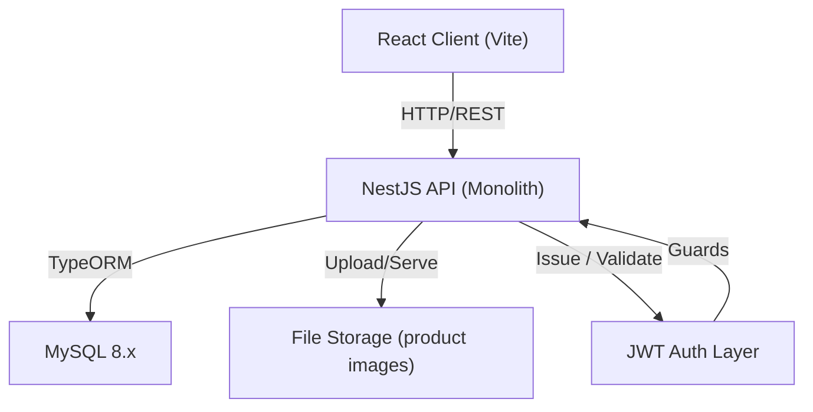
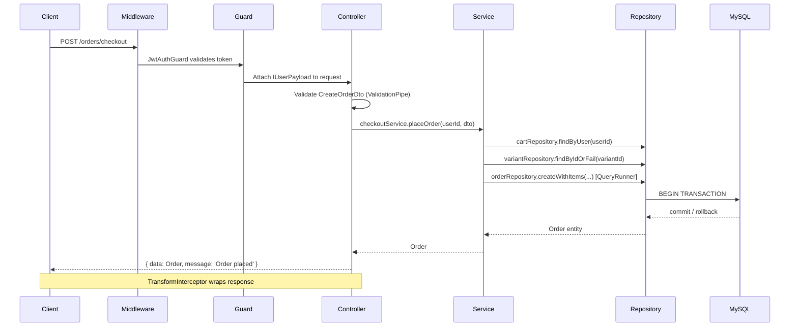

# BE-ARCHITECTURE.md — Backend (Feature-based)

## 1. System Overview



**Architecture:** Modular monolith — single deployable unit, feature-based modules.

**Rationale:**
- Each feature = 1 NestJS module (self-contained, independently testable)
- Clear boundaries now → easy to extract to microservices later
- Minimizes cross-feature coupling; shared code lives in `shared/`

---

## 2. Folder Structure

```
src/
├── main.ts                         # Bootstrap: global pipes, filters, interceptors
├── app.module.ts                   # Root module, imports all feature + core modules
│
├── config/
│   ├── app.config.ts               # PORT, NODE_ENV
│   ├── database.config.ts          # TypeOrmModuleOptions
│   └── jwt.config.ts               # JwtModuleOptions
│
├── core/
│   ├── database/
│   │   └── database.module.ts      # TypeORM async connection (uses ConfigService)
│   └── logger/
│       └── logger.module.ts        # Custom logger setup
│
├── shared/
│   ├── decorators/
│   │   ├── current-user.decorator.ts   # @CurrentUser()
│   │   ├── roles.decorator.ts          # @Roles('admin')
│   │   └── public.decorator.ts         # @Public() — skip auth guard
│   ├── filters/
│   │   └── http-exception.filter.ts    # Global error response format
│   ├── guards/
│   │   ├── jwt-auth.guard.ts           # Validates JWT, attaches user to request
│   │   └── roles.guard.ts              # Checks @Roles() metadata
│   ├── interceptors/
│   │   ├── transform.interceptor.ts    # Wraps response in { data, message }
│   │   └── logging.interceptor.ts      # Request/response timing log
│   ├── pipes/
│   │   └── validation.pipe.ts          # Global ValidationPipe config
│   ├── utils/
│   │   ├── pagination.util.ts          # buildPaginationMeta()
│   │   └── hash.util.ts                # bcrypt hash/compare
│   └── types/
│       ├── response.type.ts            # ApiResponse<T>
│       └── pagination.type.ts          # PaginationMeta
│
└── features/
    ├── auth/                       # roles, users, JWT, refresh tokens
    ├── user-profile/               # addresses
    ├── product/                    # categories, products, variants, images
    ├── cart/                       # carts, cart_items, guest merge
    ├── order/                      # orders, order_items, checkout
    └── review/                     # reviews, ratings
```

---

## 3. Feature Anatomy

### Standard feature — `auth`
```
features/auth/
├── auth.module.ts
├── auth.controller.ts
├── auth.service.ts
├── strategies/
│   └── jwt.strategy.ts
├── repositories/
│   ├── user.repository.ts
│   └── role.repository.ts
├── dto/
│   ├── register.dto.ts
│   ├── login.dto.ts
│   └── auth-response.dto.ts
├── entities/
│   ├── user.entity.ts
│   └── role.entity.ts
├── types/
│   └── jwt-payload.type.ts
├── tests/
│   ├── auth.controller.spec.ts
│   └── auth.service.spec.ts
└── CONTEXT.md                      # Feature-level doc: entities, rules, edge cases
```

### Multi-controller feature — `product`
```
features/product/
├── product.module.ts
├── controllers/
│   ├── category.controller.ts
│   ├── product.controller.ts
│   └── product-variant.controller.ts
├── services/
│   ├── category.service.ts
│   ├── product.service.ts
│   └── product-variant.service.ts
├── repositories/
│   ├── category.repository.ts
│   ├── product.repository.ts
│   ├── product-variant.repository.ts
│   └── product-image.repository.ts
├── dto/
├── entities/
│   ├── category.entity.ts
│   ├── product.entity.ts
│   ├── product-variant.entity.ts
│   └── product-image.entity.ts
├── tests/
└── CONTEXT.md
```

### Multi-service feature — `order`
```
features/order/
├── order.module.ts
├── order.controller.ts
├── services/
│   ├── order.service.ts
│   └── checkout.service.ts         # Handles cart → order conversion
├── repositories/
│   ├── order.repository.ts
│   └── order-item.repository.ts
├── dto/
│   ├── create-order.dto.ts
│   └── order-response.dto.ts
├── entities/
│   ├── order.entity.ts
│   └── order-item.entity.ts
├── types/
│   ├── order-status.type.ts
│   └── payment-status.type.ts
├── tests/
└── CONTEXT.md
```

---

## 4. Request Flow



**Layer responsibilities:**

| Layer | Responsibility |
|-------|---------------|
| Middleware | CORS, body parsing, request logging |
| Guard | JWT validation, role checking |
| Controller | Routing, DTO binding, call service, format response |
| Service | Business logic, orchestrate repositories, manage transactions |
| Repository | TypeORM queries, QueryBuilder — no business logic |

---

## 5. Cross-feature Communication

### Feature dependency map

```
auth          ← standalone
user-profile  ← auth (User entity via DI)
product       ← standalone
cart          ← auth (User), product (ProductVariant)
order         ← auth (User), product (ProductVariant), cart (checkout)
review        ← auth (User), product (Product), order (verified purchase)
```

### ✅ Allowed: Module exports + NestJS DI

```typescript
// product.module.ts
@Module({
  providers: [ProductVariantRepository],
  exports: [ProductVariantRepository],  // expose
})

// order.module.ts
@Module({
  imports: [ProductModule],             // consume via DI
})
export class OrderModule {}
```

### ✅ Allowed: Event-based async (side effects)

```typescript
// order/services/checkout.service.ts
this.eventEmitter.emit('order.created', { orderId, userId, items });

// review/listeners/order.listener.ts
@OnEvent('order.created')
handleOrderCreated(payload: OrderCreatedEvent) {
  // unlock review eligibility
}
```

### ❌ Forbidden: Direct internal imports

```typescript
// ❌ breaks feature boundary
import { UserService } from '../auth/auth.service';

// ✅ only via module re-export
import { UserService } from '@features/auth';
```

---

## 6. Shared vs Core

| `shared/` — cross-feature utilities | `core/` — infrastructure setup |
|--------------------------------------|--------------------------------|
| `@CurrentUser()`, `@Roles()`, `@Public()` | TypeORM database connection |
| `JwtAuthGuard`, `RolesGuard` | Logger module configuration |
| `HttpExceptionFilter` | Environment config loading |
| `TransformInterceptor`, `LoggingInterceptor` | |
| `ValidationPipe` config | |
| `pagination.util.ts`, `hash.util.ts` | |
| `ApiResponse<T>`, `PaginationMeta` types | |

---

## 7. Configuration Management

**Environment variables (`.env`):**
```
PORT=3000
NODE_ENV=development

DB_HOST=localhost
DB_PORT=3306
DB_USERNAME=root
DB_PASSWORD=secret
DB_NAME=ecommerce

JWT_SECRET=supersecret
JWT_EXPIRES_IN=15m
JWT_REFRESH_EXPIRES_IN=7d
```

**Config wiring:**
```typescript
// app.module.ts
ConfigModule.forRoot({ isGlobal: true, validationSchema: Joi.object({ ... }) })

// core/database/database.module.ts
TypeOrmModule.forRootAsync({
  inject: [ConfigService],
  useFactory: (config: ConfigService): TypeOrmModuleOptions => ({
    type: 'mysql',
    host: config.get('DB_HOST'),
    autoLoadEntities: true,
  }),
})
```

**Rules:**
- Never commit `.env` — commit `.env.example` as template
- Production: inject via CI/CD environment or secret manager
- Validate all env vars at startup with Joi schema — app fails fast on misconfiguration

---

## 8. Global Bootstrap (`main.ts`)

```typescript
async function bootstrap() {
  const app = await NestFactory.create(AppModule);
  const config = app.get(ConfigService);

  app.useGlobalPipes(new ValidationPipe({ transform: true, whitelist: true }));
  app.useGlobalFilters(new HttpExceptionFilter());
  app.useGlobalInterceptors(new TransformInterceptor(), new LoggingInterceptor());
  app.setGlobalPrefix('api/v1');
  app.enableCors();

  await app.listen(config.get('PORT') ?? 3000);
}
```

---

## 9. Entity Conventions (TypeORM)

```typescript
@Entity('products')
export class Product {
  @PrimaryGeneratedColumn('increment', { type: 'bigint' })
  id: number;

  @Column({ name: 'is_active', default: true })
  isActive: boolean;

  @CreateDateColumn({ name: 'created_at' })
  createdAt: Date;

  @UpdateDateColumn({ name: 'updated_at' })
  updatedAt: Date;

  @OneToMany(() => ProductVariant, (v) => v.product, { cascade: true })
  variants: ProductVariant[];
}
```

- `@CreateDateColumn` / `@UpdateDateColumn` — auto-managed by TypeORM
- `cascade: true` on parent-owned children (`Product → ProductVariant`, `Cart → CartItem`)
- Avoid eager loading — use explicit `relations` array in repository queries
- Use `QueryRunner` for any multi-step write (checkout, order creation)
