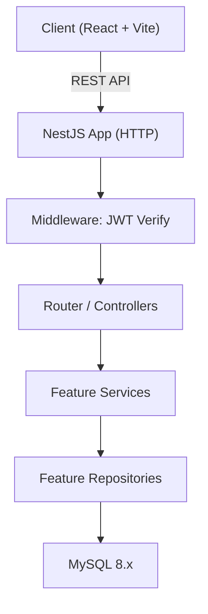
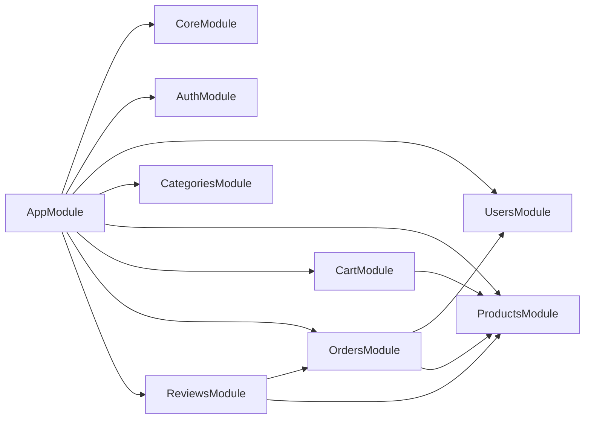

# BE-ARCHITECTURE.md

## 1. System Overview



**Why feature-based?**
- Each feature (auth, products, orders…) is an independent NestJS Module
- New developers onboard by reading one feature folder — no need to understand the whole codebase
- Features can be extracted into microservices later without restructuring

---

## 2. Folder Structure

```
src/
├── main.ts                         # Bootstrap, global middleware
├── app.module.ts                   # Root module — imports all feature modules
│
├── core/                           # Infrastructure — set up once, used everywhere
│   ├── database/
│   │   └── database.module.ts      # TypeORM forRoot config
│   └── config/
│       └── config.module.ts        # @nestjs/config forRoot
│
├── shared/                         # Reusable cross-feature code
│   ├── decorators/
│   │   └── current-user.decorator.ts
│   ├── filters/
│   │   └── http-exception.filter.ts  # Global error → standard error envelope
│   ├── guards/
│   │   ├── jwt-auth.guard.ts
│   │   └── roles.guard.ts
│   ├── interceptors/
│   │   └── transform.interceptor.ts  # Wrap all responses in success envelope
│   ├── pipes/
│   │   └── validation.pipe.ts
│   └── types/
│       └── pagination.types.ts
│
└── features/
    ├── auth/
    ├── users/
    ├── categories/
    ├── products/
    ├── cart/
    ├── orders/
    └── reviews/
```

---

## 3. Feature Anatomy

```
features/orders/
├── orders.module.ts          # @Module — imports, providers, exports
├── orders.controller.ts      # Routes, guards, param extraction
├── orders.service.ts         # Business logic
├── orders.repository.ts      # TypeORM queries only
├── dto/
│   ├── create-order.dto.ts
│   └── order-response.dto.ts
├── entities/
│   ├── order.entity.ts
│   └── order-item.entity.ts
├── types/
│   └── order.types.ts        # Enums, interfaces local to this feature
├── utils/
│   └── order-total.util.ts
├── tests/
│   ├── orders.service.spec.ts
│   └── orders.controller.spec.ts
└── context.md                # Human-readable feature summary for new devs
```

---

## 4. Request Flow

```
HTTP Request
    │
    ▼
[JwtAuthGuard]          → verify Bearer token, attach user to request
    │
    ▼
[ValidationPipe]        → validate DTO via class-validator, reject 400 early
    │
    ▼
[Controller]            → extract params/body, call service, return raw result
    │
    ▼
[Service]               → business logic, orchestrate repositories & events
    │
    ▼
[Repository]            → TypeORM queries, return entities
    │
    ▼
[MySQL]
    │
    ▼
[TransformInterceptor]  → wrap result: { success: true, data: ... }
[HttpExceptionFilter]   → on error: { success: false, error: { code, message } }
    │
    ▼
HTTP Response
```

**Layer responsibilities:**

| Layer | Responsibility | Must NOT |
|-------|---------------|----------|
| Controller | Routing, auth guard, extract DTO | Contain business logic |
| Service | Business logic, call repositories | Run raw DB queries |
| Repository | TypeORM queries, return entities | Contain business logic |

---

## 5. Cross-feature Communication

**Allowed:**

```typescript
// orders.module.ts — import the full module
@Module({
  imports: [UsersModule, ProductsModule],
})

// orders.service.ts — inject the exported service
constructor(
  private usersService: UsersService,
  private productsService: ProductsService,
) {}
```

**Forbidden:**
```typescript
import { UsersRepository } from '../users/users.repository'; // ❌ internal import
```

**Event-based (async, decoupled):**
```typescript
// After order placed — notify other features without tight coupling
this.eventEmitter.emit('order.placed', { orderId, userId });

// cart.listener.ts
@OnEvent('order.placed')
async clearCartAfterOrder(payload: OrderPlacedEvent) { ... }
```

---

## 6. Shared vs Core

| | `shared/` | `core/` |
|---|-----------|---------|
| **Purpose** | Reusable app-level utilities | Infrastructure bootstrap |
| **Contents** | Guards, interceptors, decorators, pipes, common types | DB connection, config loader |
| **Used by** | Feature modules (import as needed) | `AppModule` only (set up once) |
| **Examples** | `JwtAuthGuard`, `TransformInterceptor`, `PaginationDto` | `DatabaseModule`, `ConfigModule` |

---

## 7. NestJS Module Graph



---

## 8. Configuration Management

**Environment variables** — never hardcode, always via `ConfigService`:

```
.env.development
.env.production
.env.test
```

**Required variables:**
```ini
# App
PORT=3000
NODE_ENV=development

# Database
DB_HOST=localhost
DB_PORT=3306
DB_USERNAME=root
DB_PASSWORD=secret
DB_DATABASE=ecommerce

# Auth
JWT_SECRET=your-secret-key
JWT_EXPIRES_IN=7d
```

**Access in code:**
```typescript
// core/config/config.module.ts
ConfigModule.forRoot({ isGlobal: true, envFilePath: `.env.${process.env.NODE_ENV}` })

// any service
constructor(private config: ConfigService) {}
const port = this.config.get<number>('PORT');
```

- `.env.*` files are **git-ignored**
- Provide `.env.example` with placeholder values in source control
- Secrets in production → environment variables injected by deployment platform (never committed)
