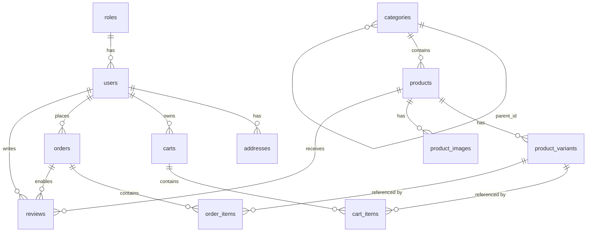

# DATABASE.md

## 1. Overview

- **Database:** MySQL 8.x
- **ORM:** TypeORM (via `@nestjs/typeorm`)
- **Naming conventions:**
  - Tables: `snake_case`, plural (e.g., `product_variants`)
  - Columns: `snake_case` (e.g., `created_at`, `stock_quantity`)
  - Indexes: `idx_<table>_<column>` (e.g., `idx_products_category_id`)
  - Foreign keys: `fk_<table>_<ref_table>` (e.g., `fk_users_roles`)

---

## 2. Entities by Feature

### Feature: auth / users
| Table | Purpose |
|-------|---------|
| `roles` | Role definitions (customer, admin, ...) |
| `users` | All registered users |
| `addresses` | Saved shipping addresses per user |

### Feature: products / categories
| Table | Purpose |
|-------|---------|
| `categories` | Hierarchical product categories |
| `products` | Product catalog |
| `product_variants` | SKU-level variants (color + size + price + stock) |
| `product_images` | Additional product images |

### Feature: cart
| Table | Purpose |
|-------|---------|
| `carts` | One cart per user or guest session |
| `cart_items` | Line items linking cart → product_variant |

### Feature: orders
| Table | Purpose |
|-------|---------|
| `orders` | Order header with status & payment info |
| `order_items` | Snapshot of items at time of purchase |

### Feature: reviews
| Table | Purpose |
|-------|---------|
| `reviews` | Purchase-verified product reviews |

---

## 3. Schema

### `roles`
| Column | Type | Constraints |
|--------|------|-------------|
| `id` | INT UNSIGNED | PK, AUTO_INCREMENT |
| `name` | VARCHAR(50) | NOT NULL, UNIQUE |

> Values: `customer`, `admin` (extensible: `seller`, `moderator`)

---

### `users`
| Column | Type | Constraints |
|--------|------|-------------|
| `id` | INT UNSIGNED | PK, AUTO_INCREMENT |
| `role_id` | INT UNSIGNED | FK → roles.id, NOT NULL |
| `email` | VARCHAR(255) | UNIQUE, NOT NULL |
| `password_hash` | VARCHAR(255) | NOT NULL |
| `full_name` | VARCHAR(100) | NOT NULL |
| `phone` | VARCHAR(20) | NULLABLE |
| `is_active` | TINYINT(1) | DEFAULT 1 |
| `created_at` | DATETIME | DEFAULT CURRENT_TIMESTAMP |
| `updated_at` | DATETIME | AUTO UPDATE |

> `is_active = 0` bans the account without deleting data.

---

### `addresses`
| Column | Type | Constraints |
|--------|------|-------------|
| `id` | INT UNSIGNED | PK, AUTO_INCREMENT |
| `user_id` | INT UNSIGNED | FK → users.id, NOT NULL |
| `full_name` | VARCHAR(100) | NOT NULL |
| `phone` | VARCHAR(20) | NOT NULL |
| `address_line` | VARCHAR(255) | NOT NULL |
| `city` | VARCHAR(100) | NOT NULL |
| `is_default` | TINYINT(1) | DEFAULT 0 |

---

### `categories`
| Column | Type | Constraints |
|--------|------|-------------|
| `id` | INT UNSIGNED | PK, AUTO_INCREMENT |
| `parent_id` | INT UNSIGNED | FK → categories.id, NULLABLE |
| `name` | VARCHAR(100) | NOT NULL |
| `slug` | VARCHAR(120) | UNIQUE, NOT NULL |

> Self-referencing `parent_id` enables multi-level hierarchy:
> `Fashion` → `Tops` → `T-Shirts`

---

### `products`
| Column | Type | Constraints |
|--------|------|-------------|
| `id` | INT UNSIGNED | PK, AUTO_INCREMENT |
| `category_id` | INT UNSIGNED | FK → categories.id, NOT NULL |
| `name` | VARCHAR(255) | NOT NULL |
| `slug` | VARCHAR(280) | UNIQUE, NOT NULL |
| `description` | TEXT | NULLABLE |
| `thumbnail_url` | VARCHAR(500) | NULLABLE |
| `is_active` | TINYINT(1) | DEFAULT 1 |
| `created_at` | DATETIME | DEFAULT CURRENT_TIMESTAMP |
| `updated_at` | DATETIME | AUTO UPDATE |

---

### `product_variants`
| Column | Type | Constraints |
|--------|------|-------------|
| `id` | INT UNSIGNED | PK, AUTO_INCREMENT |
| `product_id` | INT UNSIGNED | FK → products.id, NOT NULL |
| `sku` | VARCHAR(100) | UNIQUE, NOT NULL |
| `color` | VARCHAR(50) | NULLABLE |
| `size` | VARCHAR(20) | NULLABLE |
| `price` | DECIMAL(12,2) | NOT NULL |
| `sale_price` | DECIMAL(12,2) | NULLABLE |
| `stock_quantity` | INT UNSIGNED | DEFAULT 0 |

> **Central transaction table.** Both `cart_items` and `order_items` link here — not to `products`.
> Each (color + size) combination = one variant row.

---

### `product_images`
| Column | Type | Constraints |
|--------|------|-------------|
| `id` | INT UNSIGNED | PK, AUTO_INCREMENT |
| `product_id` | INT UNSIGNED | FK → products.id, NOT NULL |
| `image_url` | VARCHAR(500) | NOT NULL |
| `sort_order` | TINYINT UNSIGNED | DEFAULT 0 |

---

### `carts`
| Column | Type | Constraints |
|--------|------|-------------|
| `id` | INT UNSIGNED | PK, AUTO_INCREMENT |
| `user_id` | INT UNSIGNED | FK → users.id, **NULLABLE** |
| `session_id` | VARCHAR(128) | NULLABLE |
| `created_at` | DATETIME | DEFAULT CURRENT_TIMESTAMP |

> `user_id` is nullable to support **guest carts**. On login, merge guest cart into user cart.

---

### `cart_items`
| Column | Type | Constraints |
|--------|------|-------------|
| `id` | INT UNSIGNED | PK, AUTO_INCREMENT |
| `cart_id` | INT UNSIGNED | FK → carts.id, NOT NULL |
| `product_variant_id` | INT UNSIGNED | FK → product_variants.id, NOT NULL |
| `quantity` | SMALLINT UNSIGNED | NOT NULL, DEFAULT 1 |

---

### `orders`
| Column | Type | Constraints |
|--------|------|-------------|
| `id` | INT UNSIGNED | PK, AUTO_INCREMENT |
| `user_id` | INT UNSIGNED | FK → users.id, NOT NULL |
| `status` | ENUM | `pending`,`confirmed`,`shipping`,`delivered`,`cancelled` |
| `payment_method` | ENUM | `cod`,`banking`,`momo` |
| `payment_status` | ENUM | `unpaid`,`paid` |
| `shipping_fee` | DECIMAL(10,2) | DEFAULT 0 |
| `total_amount` | DECIMAL(12,2) | NOT NULL |
| `shipping_address` | JSON | NOT NULL |
| `created_at` | DATETIME | DEFAULT CURRENT_TIMESTAMP |

> `shipping_address` is stored as **JSON snapshot**, not a FK to `addresses`.
> Reason: user may later edit/delete their address — order history must remain immutable.
>
> `payment_status` is independent from `order status` — an order can be `cancelled` yet `paid` (requiring refund).

---

### `order_items`
| Column | Type | Constraints |
|--------|------|-------------|
| `id` | INT UNSIGNED | PK, AUTO_INCREMENT |
| `order_id` | INT UNSIGNED | FK → orders.id, NOT NULL |
| `product_variant_id` | INT UNSIGNED | FK → product_variants.id, NOT NULL |
| `product_name` | VARCHAR(255) | NOT NULL (snapshot) |
| `sku` | VARCHAR(100) | NOT NULL (snapshot) |
| `price` | DECIMAL(12,2) | NOT NULL (snapshot) |
| `quantity` | SMALLINT UNSIGNED | NOT NULL |
| `thumbnail_url` | VARCHAR(500) | NULLABLE (snapshot) |

> Snapshots (name, sku, price, thumbnail) protect order history from future product edits.
> `product_variant_id` FK is kept for navigating to the product page if it still exists.

---

### `reviews`
| Column | Type | Constraints |
|--------|------|-------------|
| `id` | INT UNSIGNED | PK, AUTO_INCREMENT |
| `user_id` | INT UNSIGNED | FK → users.id, NOT NULL |
| `product_id` | INT UNSIGNED | FK → products.id, NOT NULL |
| `order_id` | INT UNSIGNED | FK → orders.id, NOT NULL |
| `rating` | TINYINT UNSIGNED | NOT NULL, CHECK 1–5 |
| `comment` | TEXT | NULLABLE |
| `created_at` | DATETIME | DEFAULT CURRENT_TIMESTAMP |

> `order_id` enforces purchase-verified reviews — only buyers can review.

---

## 4. ERD (Mermaid)

---

## 5. Conventions

- **Primary keys:** `INT UNSIGNED AUTO_INCREMENT` on all tables
- **Soft delete:** `is_active` flag on `users` and `products` (no physical delete)
- **Timestamps:** `created_at` + `updated_at` on `users`, `products`, `carts`, `orders`, `reviews`
- **Enum handling:** Use MySQL `ENUM` type for status fields; mirror as TypeScript `enum` in TypeORM entities
- **JSON fields:** Only `orders.shipping_address` — intentional snapshot pattern, not a design gap

---

## 6. Migration Rules

- **Naming format:** `{timestamp}_{description}.ts` — e.g., `1714000000000-CreateUsersTable.ts`
- **Versioning:** TypeORM migrations, one file per change, committed to source control
- **Never edit** a migration that has already run in production — create a new one
- **Rollback:** Each migration must implement both `up()` and `down()` methods
- **Run order:** Migrations execute in timestamp order; never manually reorder files

---

## 7. TypeORM Notes

- Define entities with `@Entity()`, `@Column()`, `@PrimaryGeneratedColumn()`
- Use `@CreateDateColumn()` / `@UpdateDateColumn()` for timestamps (auto-managed)
- Enum columns: `@Column({ type: 'enum', enum: OrderStatus })`
- JSON columns: `@Column({ type: 'json' })` for `shipping_address`
- Lazy relations are **disabled** by default — use explicit `relations` in queries
- Index example: `@Index(['user_id'])` or `@Index(['slug'], { unique: true })`
