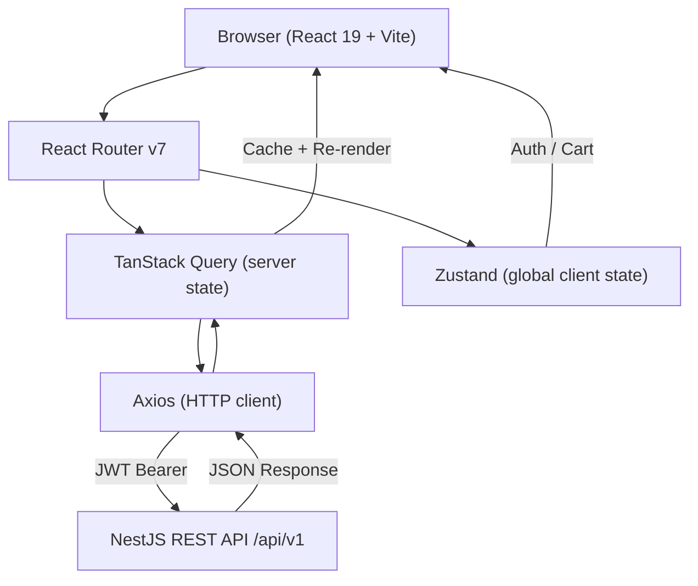
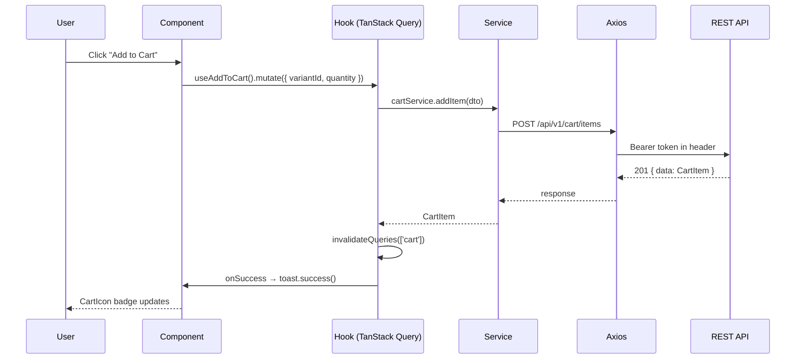

# FE-ARCHITECTURE.md — Frontend (Feature-based)

## 1. System Overview



**Architecture:** Feature-based SPA — each feature is a self-contained module (components + hooks + services + types).

**Tech stack rationale:**

| Tool | Why |
|------|-----|
| React 19 + Vite | Fast dev server, modern React features (`use()` hook) |
| TypeScript strict | Type safety, better DX, catch errors at compile time |
| TanStack Query | Server state caching, auto-refetch, deduplication |
| Zustand | Minimal global state — auth + cart only |
| Tailwind CSS | Utility-first, consistent design system, no CSS files |
| Axios | Interceptors for auto token refresh, centralized error handling |
| React Router v7 | Nested layouts, lazy loading, type-safe params |

---

## 2. Folder Structure

```
src/
├── main.tsx                        # Entry point, render <App> in StrictMode
├── App.tsx                         # QueryClientProvider + RouterProvider wrapper
│
├── config/
│   ├── constants.ts                # API_BASE_URL, MAX_CART_ITEMS, etc.
│   └── env.ts                      # Typed import.meta.env wrapper
│
├── routes/
│   ├── index.tsx                   # createBrowserRouter — all route definitions
│   ├── routes.ts                   # ROUTES constants (type-safe, as const)
│   ├── ProtectedRoute.tsx          # Checks auth → Outlet or Navigate to /login
│   └── AdminRoute.tsx              # Checks admin role → Outlet or Navigate
│
├── layouts/
│   ├── MainLayout.tsx              # Header + Footer + <Outlet />
│   ├── AuthLayout.tsx              # Centered card, for login/register
│   └── AdminLayout.tsx            # Sidebar + Header + <Outlet />
│
├── shared/
│   ├── components/
│   │   ├── ui/                     # Button, Input, Modal, Dropdown, Badge
│   │   ├── feedback/               # Toast, Skeleton, Spinner, ErrorMessage
│   │   └── layout/                 # Header, Footer, Sidebar (used by layouts)
│   ├── hooks/
│   │   ├── useDebounce.ts          # Debounce search input
│   │   ├── useLocalStorage.ts      # Type-safe localStorage wrapper
│   │   └── useMediaQuery.ts        # Responsive breakpoints
│   ├── lib/
│   │   ├── axios.ts                # Axios instance + request/response interceptors
│   │   └── queryClient.ts          # TanStack Query client config
│   ├── stores/
│   │   └── ui.store.ts             # Theme, sidebarOpen (non-critical global UI)
│   ├── types/
│   │   ├── api.types.ts            # ApiResponse<T>, PaginatedResponse<T>
│   │   └── common.types.ts         # ID, Timestamp, etc.
│   └── utils/
│       ├── format.utils.ts         # formatPrice(), formatDate()
│       └── validation.utils.ts     # Shared Zod schemas (email, phone)
│
├── features/
│   ├── auth/
│   ├── user-profile/
│   ├── product/
│   ├── cart/
│   ├── checkout/
│   ├── order/
│   └── review/
│
└── assets/
    ├── images/
    └── icons/
```

---

## 3. Feature Anatomy

### `auth` — standalone, provides user state

```
features/auth/
├── components/
│   ├── LoginForm.tsx
│   └── RegisterForm.tsx
├── hooks/
│   ├── useLogin.ts             # useMutation → auth.service.login()
│   └── useRegister.ts          # useMutation → auth.service.register()
├── services/
│   └── auth.service.ts         # login(), register(), refresh(), logout()
├── stores/
│   └── auth.store.ts           # user, isAuthenticated, setUser, clear
├── types/
│   └── auth.types.ts           # User, LoginRequest, AuthResponse
├── pages/
│   ├── LoginPage.tsx
│   └── RegisterPage.tsx
├── index.ts                    # barrel exports
└── CONTEXT.md
```

### `product` — multi-component, standalone

```
features/product/
├── components/
│   ├── CategoryNav.tsx
│   ├── ProductCard.tsx
│   ├── ProductList.tsx
│   ├── ProductFilters.tsx
│   ├── VariantSelector.tsx
│   └── ProductImageGallery.tsx
├── hooks/
│   ├── useCategories.ts        # useQuery → GET /categories
│   ├── useProducts.ts          # useQuery with filters + pagination
│   └── useProductDetail.ts     # useQuery → GET /products/:slug
├── services/
│   └── product.service.ts
├── types/
│   └── product.types.ts        # Product, ProductVariant, Category
├── utils/
│   └── product.utils.ts        # buildFilterParams(), getVariantPrice()
├── pages/
│   ├── ProductListPage.tsx
│   └── ProductDetailPage.tsx
├── index.ts
└── CONTEXT.md
```

### `cart` — global state + optimistic updates

```
features/cart/
├── components/
│   ├── CartIcon.tsx            # Header badge with item count
│   ├── CartDrawer.tsx          # Slide-out panel
│   ├── CartItem.tsx
│   └── CartSummary.tsx
├── hooks/
│   ├── useCart.ts              # useQuery → GET /cart
│   ├── useAddToCart.ts         # useMutation with optimistic update
│   └── useUpdateCartItem.ts    # useMutation with optimistic update
├── services/
│   └── cart.service.ts
├── stores/
│   └── cart.store.ts           # cartCount for header badge (Zustand)
├── types/
│   └── cart.types.ts
├── pages/
│   └── CartPage.tsx
├── index.ts
└── CONTEXT.md
```

### `checkout` — depends on cart + user-profile

```
features/checkout/
├── components/
│   ├── CheckoutSteps.tsx       # Progress: Address → Payment → Confirm
│   ├── AddressSelector.tsx     # Lists user addresses, select one
│   ├── PaymentMethodSelector.tsx
│   ├── OrderSummary.tsx
│   └── CheckoutForm.tsx        # React Hook Form + Zod
├── hooks/
│   └── useCheckout.ts          # useMutation → POST /orders/checkout
├── services/
│   └── checkout.service.ts     # createOrder()
├── types/
│   └── checkout.types.ts       # CheckoutRequest, CheckoutStep
├── pages/
│   └── CheckoutPage.tsx
├── index.ts
└── CONTEXT.md
```

---

## 4. Data Flow



**Checkout flow:**
1. `CheckoutForm` calls `useCheckout().mutate(data)`
2. `checkout.service.createOrder()` → `POST /orders/checkout`
3. On success: `invalidateQueries(['cart'])` + `navigate(ROUTES.ORDER_DETAIL)`
4. On error: toast error, keep form data intact

---

## 5. Routing Structure

```tsx
// routes/routes.ts
export const ROUTES = {
  HOME: '/',
  LOGIN: '/login',
  REGISTER: '/register',
  PRODUCTS: '/products',
  PRODUCT_DETAIL: '/products/:slug',
  CATEGORY: '/categories/:slug',
  CART: '/cart',
  CHECKOUT: '/checkout',
  ORDERS: '/orders',
  ORDER_DETAIL: '/orders/:id',
  PROFILE: '/profile',
  ADDRESSES: '/profile/addresses',
  ADMIN_PRODUCTS: '/admin/products',
  ADMIN_ORDERS: '/admin/orders',
} as const;
```

```tsx
// routes/index.tsx
const routes: RouteObject[] = [
  {
    path: '/',
    element: <MainLayout />,           // Header + Footer + Outlet
    errorElement: <RouteErrorPage />,
    children: [
      { index: true, element: <HomePage /> },
      { path: 'products', element: <ProductListPage /> },
      { path: 'products/:slug', element: <ProductDetailPage /> },
      { path: 'categories/:slug', element: <ProductListPage /> },
    ],
  },
  {
    path: '/',
    element: <AuthLayout />,           // Centered card
    children: [
      { path: 'login', element: <LoginPage /> },
      { path: 'register', element: <RegisterPage /> },
    ],
  },
  {
    path: '/',
    element: <ProtectedRoute />,       // Checks auth → Outlet or redirect
    children: [{
      element: <MainLayout />,
      children: [
        { path: 'cart', element: <CartPage /> },
        { path: 'checkout', element: <CheckoutPage /> },
        { path: 'orders', element: <OrderListPage /> },
        { path: 'orders/:id', element: <OrderDetailPage /> },
        { path: 'profile', element: <ProfilePage /> },
        { path: 'profile/addresses', element: <AddressListPage /> },
      ],
    }],
  },
  {
    path: '/admin',
    element: <AdminRoute />,           // Checks admin role
    children: [{
      element: <AdminLayout />,        // Sidebar + Header + Outlet
      children: [
        { path: 'products', element: <AdminProductListPage /> },
        { path: 'orders', element: <AdminOrderListPage /> },
        { path: 'categories', element: <AdminCategoryPage /> },
      ],
    }],
  },
];

export const router = createBrowserRouter(routes);
```

**Lazy loading all page components:**
```tsx
const ProductListPage = lazy(() => import('@/features/product/pages/ProductListPage'));
// Wrap route children in <Suspense fallback={<PageSkeleton />}>
```

---

## 6. State Management Strategy

| State Type | Tool | Example |
|------------|------|---------|
| Server data | TanStack Query | products, orders, reviews |
| Auth state | Zustand (`auth.store`) | user, isAuthenticated |
| Cart count | Zustand (`cart.store`) | cartCount for header badge |
| Filters / pagination | `useSearchParams` (URL) | `?page=2&category=5` |
| Form data | React Hook Form | checkout form, review form |
| Local UI state | `useState` | modal open, dropdown toggle |
| Global UI | Zustand (`ui.store`) | sidebarOpen, theme |

**Rules:**
- Server data → TanStack Query (NEVER Zustand)
- Auth/Cart → Zustand (needed across multiple features)
- Filters/Pagination → URL (shareable, bookmarkable)
- Forms → React Hook Form (local to form component)

---

## 7. API Layer

```
shared/lib/axios.ts
├── baseURL from config/constants.ts
├── Request interceptor: attach Authorization: Bearer <accessToken>
├── Response interceptor: on 401 → call refresh → retry original request
└── Error interceptor: transform to AppError { code, message }
    ↓
features/[x]/services/[x].service.ts
├── Typed request params + response shapes
├── Returns raw axios promise (TanStack Query resolves)
    ↓
features/[x]/hooks/use[X].ts
├── useQuery (GET) with queryKey: ['resource', params]
├── useMutation (POST/PUT/DELETE) with invalidation
    ↓
features/[x]/components or pages
├── Consume hooks only — no direct service calls
└── Render loading / error / success states
```

**Axios interceptor (token refresh):**
```typescript
// shared/lib/axios.ts
api.interceptors.response.use(
  (res) => res,
  async (err) => {
    if (err.response?.status === 401 && !err.config._retry) {
      err.config._retry = true;
      await authService.refresh();           // refresh_token via httpOnly cookie
      return api.request(err.config);        // retry original request
    }
    return Promise.reject(err);
  }
);
```

---

## 8. Shared vs Features

| `shared/` — reusable across all features | `features/` — feature-specific |
|------------------------------------------|-------------------------------|
| `Button`, `Input`, `Modal`, `Toast` | `ProductCard`, `CartItem`, `CheckoutForm` |
| `useDebounce`, `useLocalStorage` | `useProducts`, `useCart`, `useCheckout` |
| `axios` instance, `queryClient` | `product.service`, `cart.service` |
| `ApiResponse<T>`, `PaginatedResponse<T>` | `Product`, `Cart`, `Order` types |
| `formatPrice()`, `formatDate()` | `getVariantPrice()`, `buildFilterParams()` |
| `Skeleton`, `Spinner`, `ErrorBoundary` | `ProductSkeleton`, `CartSkeleton` |

**Import rules:**
- Features ✅ can import from `shared/`
- Features ✅ can import other features' public exports via `index.ts`
- Features ❌ cannot import from another feature's internal files
- `shared/` ❌ cannot import from `features/`
